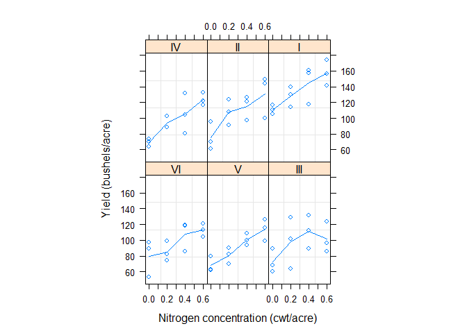
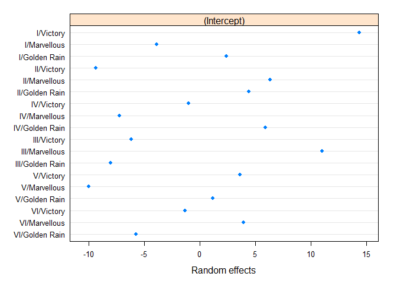

# Mixed Effects Models

from Christoph Scherber (https://www.youtube.com/watch?v=VhMWPkTbXoY) 

##Load packages  

```r
library(nlme)
```

##Load data  

```r
data(Oats)
str(Oats)
```

```
## Classes 'nfnGroupedData', 'nfGroupedData', 'groupedData' and 'data.frame':	72 obs. of  4 variables:
##  $ Block  : Ord.factor w/ 6 levels "VI"<"V"<"III"<..: 6 6 6 6 6 6 6 6 6 6 ...
##  $ Variety: Factor w/ 3 levels "Golden Rain",..: 3 3 3 3 1 1 1 1 2 2 ...
##  $ nitro  : num  0 0.2 0.4 0.6 0 0.2 0.4 0.6 0 0.2 ...
##  $ yield  : num  111 130 157 174 117 114 161 141 105 140 ...
##  - attr(*, "formula")=Class 'formula'  language yield ~ nitro | Block
##   .. ..- attr(*, ".Environment")=<environment: R_GlobalEnv> 
##  - attr(*, "labels")=List of 2
##   ..$ y: chr "Yield"
##   ..$ x: chr "Nitrogen concentration"
##  - attr(*, "units")=List of 2
##   ..$ y: chr "(bushels/acre)"
##   ..$ x: chr "(cwt/acre)"
##  - attr(*, "inner")=Class 'formula'  language ~Variety
##   .. ..- attr(*, ".Environment")=<environment: R_GlobalEnv>
```

```r
head(Oats)
```

```
## Grouped Data: yield ~ nitro | Block
##   Block     Variety nitro yield
## 1     I     Victory   0.0   111
## 2     I     Victory   0.2   130
## 3     I     Victory   0.4   157
## 4     I     Victory   0.6   174
## 5     I Golden Rain   0.0   117
## 6     I Golden Rain   0.2   114
```

```r
plot(Oats)
```

<!-- -->

###Model - assume you don't know anything about data structure

```r
model1 <- lm(yield ~ Variety * nitro, data = Oats)
summary(model1)
```

```
## 
## Call:
## lm(formula = yield ~ Variety * nitro, data = Oats)
## 
## Residuals:
##     Min      1Q  Median      3Q     Max 
## -35.950 -14.967  -1.258  12.675  52.050 
## 
## Coefficients:
##                         Estimate Std. Error t value Pr(>|t|)    
## (Intercept)               81.900      7.342  11.155  < 2e-16 ***
## VarietyMarvellous          8.517     10.383   0.820 0.415033    
## VarietyVictory            -8.600     10.383  -0.828 0.410506    
## nitro                     75.333     19.622   3.839 0.000279 ***
## VarietyMarvellous:nitro  -10.750     27.750  -0.387 0.699718    
## VarietyVictory:nitro       5.750     27.750   0.207 0.836487    
## ---
## Signif. codes:  0 '***' 0.001 '**' 0.01 '*' 0.05 '.' 0.1 ' ' 1
## 
## Residual standard error: 21.5 on 66 degrees of freedom
## Multiple R-squared:  0.4134,	Adjusted R-squared:  0.369 
## F-statistic: 9.303 on 5 and 66 DF,  p-value: 9.66e-07
```

Intercept is yield of 81.9 bushels per hectare for variety `GoldenRain` at a nitrogen concentration of 0.  `GoldenRain` is first because its first in alphabet.  `Marvellous ` has 8.517 bushels per hectare more than `GoldenRain` at 0 nitrogen.

`nitro` effect is a positive slope (75.333).  `Marvellous:nitro` slope is 75.333 - 10.750, `Victory:nitro` slope is 75.333 + 5.750.  

**quite complex to interpret**

###Model with mixed effects: 

```r
#just fixed effects
lme(yield ~ Variety * nitro, data = Oats)
```

```
## Linear mixed-effects model fit by REML
##   Data: Oats 
##   Log-restricted-likelihood: -275.2318
##   Fixed: yield ~ Variety * nitro 
##             (Intercept)       VarietyMarvellous          VarietyVictory 
##               81.900000                8.516667               -8.600000 
##                   nitro VarietyMarvellous:nitro    VarietyVictory:nitro 
##               75.333333              -10.750000                5.750000 
## 
## Random effects:
##  Formula: ~Variety * nitro | Block
##  Structure: General positive-definite
##                         StdDev    Corr                              
## (Intercept)             16.364106 (Intr) VrtyMr VrtyVc nitro  VrtyM:
## VarietyMarvellous       15.220228 -0.388                            
## VarietyVictory           5.761979  0.097 -0.269                     
## nitro                   36.139639 -0.289 -0.052  0.923              
## VarietyMarvellous:nitro 27.257873  0.350 -0.145 -0.866 -0.980       
## VarietyVictory:nitro    50.321174  0.503 -0.223 -0.775 -0.952  0.985
## Residual                11.246323                                   
## 
## Number of Observations: 72
## Number of Groups: 6
```

```r
#now add random effects
lme(yield ~ Variety * nitro, data = Oats, 
              random = ~1 | Block/Variety/nitro)
```

```
## Linear mixed-effects model fit by REML
##   Data: Oats 
##   Log-restricted-likelihood: -281.6186
##   Fixed: yield ~ Variety * nitro 
##             (Intercept)       VarietyMarvellous          VarietyVictory 
##               81.900000                8.516667               -8.600000 
##                   nitro VarietyMarvellous:nitro    VarietyVictory:nitro 
##               75.333333              -10.750000                5.750000 
## 
## Random effects:
##  Formula: ~1 | Block
##         (Intercept)
## StdDev:    14.64499
## 
##  Formula: ~1 | Variety %in% Block
##         (Intercept)
## StdDev:    10.39938
## 
##  Formula: ~1 | nitro %in% Variety %in% Block
##         (Intercept) Residual
## StdDev:    11.78614 5.462276
## 
## Number of Observations: 72
## Number of Groups: 
##                         Block            Variety %in% Block 
##                             6                            18 
## nitro %in% Variety %in% Block 
##                            72
```

```r
#but model is now saturated with random effects, i.e. there are as many combinations of random effects (72) as there are data points (72) in the model.  So remove the lowest level random effect

model2 <- lme(yield ~ Variety * nitro, data = Oats, 
              random = ~1 | Block/Variety)
model2
```

```
## Linear mixed-effects model fit by REML
##   Data: Oats 
##   Log-restricted-likelihood: -281.6186
##   Fixed: yield ~ Variety * nitro 
##             (Intercept)       VarietyMarvellous          VarietyVictory 
##               81.900000                8.516667               -8.600000 
##                   nitro VarietyMarvellous:nitro    VarietyVictory:nitro 
##               75.333333              -10.750000                5.750000 
## 
## Random effects:
##  Formula: ~1 | Block
##         (Intercept)
## StdDev:    14.64485
## 
##  Formula: ~1 | Variety %in% Block
##         (Intercept) Residual
## StdDev:    10.39931 12.99039
## 
## Number of Observations: 72
## Number of Groups: 
##              Block Variety %in% Block 
##                  6                 18
```

```r
summary(model2)
```

```
## Linear mixed-effects model fit by REML
##  Data: Oats 
##        AIC      BIC    logLik
##   581.2372 600.9441 -281.6186
## 
## Random effects:
##  Formula: ~1 | Block
##         (Intercept)
## StdDev:    14.64485
## 
##  Formula: ~1 | Variety %in% Block
##         (Intercept) Residual
## StdDev:    10.39931 12.99039
## 
## Fixed effects: yield ~ Variety * nitro 
##                             Value Std.Error DF   t-value p-value
## (Intercept)              81.90000  8.570709 51  9.555802  0.0000
## VarietyMarvellous         8.51667  8.684675 10  0.980655  0.3499
## VarietyVictory           -8.60000  8.684675 10 -0.990250  0.3454
## nitro                    75.33333 11.858549 51  6.352660  0.0000
## VarietyMarvellous:nitro -10.75000 16.770521 51 -0.641006  0.5244
## VarietyVictory:nitro      5.75000 16.770521 51  0.342864  0.7331
##  Correlation: 
##                         (Intr) VrtyMr VrtyVc nitro  VrtyM:
## VarietyMarvellous       -0.507                            
## VarietyVictory          -0.507  0.500                     
## nitro                   -0.415  0.410  0.410              
## VarietyMarvellous:nitro  0.294 -0.579 -0.290 -0.707       
## VarietyVictory:nitro     0.294 -0.290 -0.579 -0.707  0.500
## 
## Standardized Within-Group Residuals:
##         Min          Q1         Med          Q3         Max 
## -1.78878616 -0.64954437 -0.06301233  0.57818020  1.63463799 
## 
## Number of Observations: 72
## Number of Groups: 
##              Block Variety %in% Block 
##                  6                 18
```

**model performance**

``` 
  Data: Oats 
       AIC      BIC    logLik
  581.2372 600.9441 -281.6186
```

**confirms structure of model**  

```
Number of Observations: 72 = lowest level of replication
Number of Groups: 
             Block Variety %in% Block 
                 6                 18 
           
**variation attributable to the random effects**

Random effects:
 Formula: ~1 | Block
        (Intercept)
StdDev:    14.64485

 Formula: ~1 | Variety %in% Block
        (Intercept) Residual
StdDev:    10.39931 12.99039
```

There was quite a bit of variation between blocks, variety and residual variance in nitrogen.  

**Estimate of fixed effects in the model**  

```
Fixed effects: yield ~ Variety * nitro 
                            Value Std.Error DF   t-value p-value
(Intercept)              81.90000  8.570709 51  9.555802  0.0000
VarietyMarvellous         8.51667  8.684675 10  0.980655  0.3499
VarietyVictory           -8.60000  8.684675 10 -0.990250  0.3454
nitro                    75.33333 11.858549 51  6.352660  0.0000
VarietyMarvellous:nitro -10.75000 16.770521 51 -0.641006  0.5244
VarietyVictory:nitro      5.75000 16.770521 51  0.342864  0.7331
 Correlation: 
                        (Intr) VrtyMr VrtyVc nitro  VrtyM:
VarietyMarvellous       -0.507                            
VarietyVictory          -0.507  0.500                     
nitro                   -0.415  0.410  0.410              
VarietyMarvellous:nitro  0.294 -0.579 -0.290 -0.707       
VarietyVictory:nitro     0.294 -0.290 -0.579 -0.707  0.500
```

The estimates (`Value`) are identical to model1 (standard linear model).  The errors are completely different.  

###Compare the coefficients in model 1 and 2

```r
#model1 coefficients
coef(model1)
```

```
##             (Intercept)       VarietyMarvellous          VarietyVictory 
##               81.900000                8.516667               -8.600000 
##                   nitro VarietyMarvellous:nitro    VarietyVictory:nitro 
##               75.333333              -10.750000                5.750000
```

```r
#model2 coefficients
coef(model2)
```

```
##                 (Intercept) VarietyMarvellous VarietyVictory    nitro
## VI/Golden Rain     69.89231          8.516667           -8.6 75.33333
## VI/Marvellous      79.57387          8.516667           -8.6 75.33333
## VI/Victory         74.29847          8.516667           -8.6 75.33333
## V/Golden Rain      72.45580          8.516667           -8.6 75.33333
## V/Marvellous       61.27555          8.516667           -8.6 75.33333
## V/Victory          74.88368          8.516667           -8.6 75.33333
## III/Golden Rain    67.29868          8.516667           -8.6 75.33333
## III/Marvellous     86.33208          8.516667           -8.6 75.33333
## III/Victory        69.18703          8.516667           -8.6 75.33333
## IV/Golden Rain     83.09717          8.516667           -8.6 75.33333
## IV/Marvellous      69.93864          8.516667           -8.6 75.33333
## IV/Victory         76.17321          8.516667           -8.6 75.33333
## II/Golden Rain     88.94013          8.516667           -8.6 75.33333
## II/Marvellous      90.88843          8.516667           -8.6 75.33333
## II/Victory         75.18213          8.516667           -8.6 75.33333
## I/Golden Rain     109.71591          8.516667           -8.6 75.33333
## I/Marvellous      103.39143          8.516667           -8.6 75.33333
## I/Victory         121.67549          8.516667           -8.6 75.33333
##                 VarietyMarvellous:nitro VarietyVictory:nitro
## VI/Golden Rain                   -10.75                 5.75
## VI/Marvellous                    -10.75                 5.75
## VI/Victory                       -10.75                 5.75
## V/Golden Rain                    -10.75                 5.75
## V/Marvellous                     -10.75                 5.75
## V/Victory                        -10.75                 5.75
## III/Golden Rain                  -10.75                 5.75
## III/Marvellous                   -10.75                 5.75
## III/Victory                      -10.75                 5.75
## IV/Golden Rain                   -10.75                 5.75
## IV/Marvellous                    -10.75                 5.75
## IV/Victory                       -10.75                 5.75
## II/Golden Rain                   -10.75                 5.75
## II/Marvellous                    -10.75                 5.75
## II/Victory                       -10.75                 5.75
## I/Golden Rain                    -10.75                 5.75
## I/Marvellous                     -10.75                 5.75
## I/Victory                        -10.75                 5.75
```

Model 1 only has an intercept for each variety  - accross all blocks.  Model 2 has a separate intercept for each block and variety combination.  

###Plot random effects of the model


```r
plot(ranef(model2))
```

<!-- -->

should show symmetrical distribution of random effects around 0.  There should be no particular pattern.  Also size of effect is important: if they are large then you really need them in the model. 

### Plot residuals in the model to check for heteroskedasticity


```r
plot(model2)
```

<!-- -->

symmetrical scatter of residuals around 0 with no pattern.  


